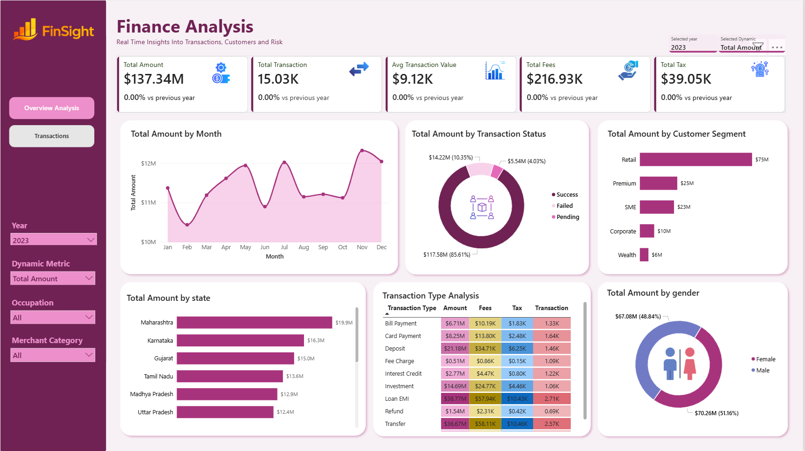
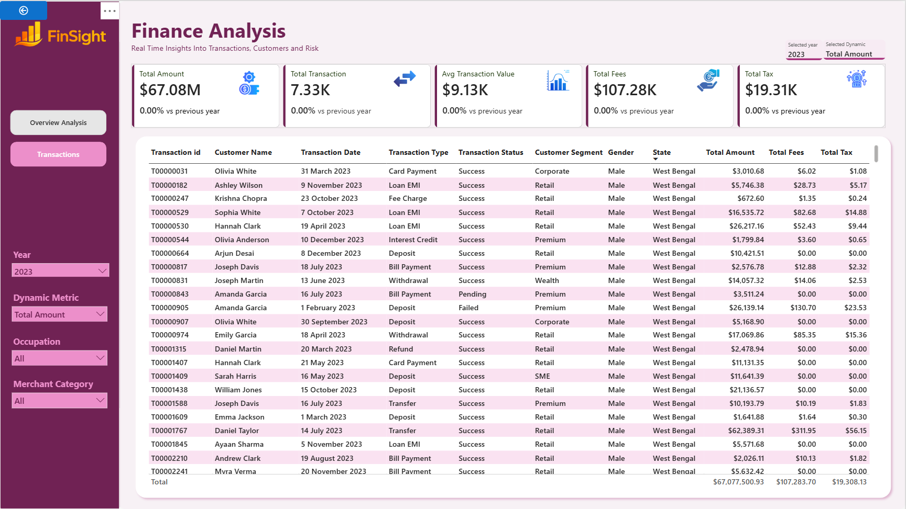

# Finance Analytics Dashboard (Power BI)

> Interactive Power BI dashboard analyzing financial transactions, customer demographics, fees, taxes, transaction performance, and year-over-year trends using an end-to-end data model.




---

## Table of Contents

1. [Project Overview](#1-project-overview)
2. [Objectives](#2-objectives)
3. [Project Scope & Tools](#3-project-scope--tools)
4. [Repository Structure](#4-repository-structure)
5. [Data Workflow](#5-data-workflow)
6. [Data Model & Schema](#6-data-model--schema)
7. [Dashboard Pages](#7-analysis--metrics)
8. [KPIs & DAX Measures](#8-analysis--metrics)
9. [Analysis & Metrics](#9-analysis--metrics)
10. [Key Insights](#10-key-insights)
11. [Recommendations](#11-recommendations)
12. [Assumptions & Limitations](#12-assumptions--limitations)
13. [Future Enhancements](#13-future-enhancements)
14. [Deliverables](#14-deliverables)
15. [Author](#15-author)

---

## 1. Project Overview

**Context:** 
A financial organization requires an interactive Power BI dashboard to monitor financial performance, customer behavior, transaction trends, fees, taxes, and operational efficiency.

The solution provides decision-makers with a centralized analytical platform capable of monitoring KPIs, evaluating transaction performance, analyzing customer demographics, and identifying business opportunities through interactive reporting.

**Business Problem** 
Management needed a single dashboard capable of:

- Monitoring financial performance
- Tracking transaction growth
- Comparing yearly performance
- Identifying successful and failed transactions
- Understanding customer behavior
- Measuring state performance
- Analyzing transaction types
- Monitoring fees and taxes
- Supporting detailed drill-through analysis

**Approach:**  
Using Microsoft Excel, Power Query, Pivot Tables, Pivot Charts, and slicers, raw sales data was cleaned, transformed, analyzed, and visualized into an interactive dashboard.

**Outcome:**
The final result is a dynamic sales performance dashboard that provides insights into revenue, profit, shipping methods, customer segments, and regional sales performance.

---

## 2. Objectives

### Primary Objective

Build an interactive **Finance Analytics Dashboard in Power BI** that enables stakeholders to monitor financial performance, analyze customer behavior, and evaluate transaction trends through dynamic and data-driven visualizations.

### Secondary Objectives

- Monitor key financial KPIs, including Total Amount, Total Transactions, Average Transaction Value, Total Fees, and Total Tax.
- Analyze transaction trends across time, customer segments, transaction types, and geographic regions.
- Evaluate operational performance through transaction status and Year-over-Year (YoY) analysis.
- Provide interactive reporting with dynamic filters, KPI switching, and drill-through capabilities to support business decision-making.

> 💡 *All dashboard components, DAX measures, and visualizations were designed to support these business objectives and deliver actionable financial insights.*
---

## 3. Project Scope & Tools

### Project Scope

| Dimension | Details |
|-----------|---------|
| **In Scope** | Financial transaction analysis, customer demographics, transaction status, customer segments, state-wise performance, transaction type analysis, fees, taxes, and Year-over-Year (YoY) performance. |
| **Out of Scope** | Predictive analytics, fraud detection modeling, real-time data streaming, and machine learning analysis. |
| **Data Sources** | Two CSV datasets: **Financial Transactions** and **Customers**. |
| **Time Period** | Historical financial transaction data used for dashboard analysis. |
| **Granularity** | Transaction-level records linked to customer information through a relational data model. |

### Tools & Technologies

| Category | Tool(s) Used |
|----------|--------------|
| **Business Intelligence** | Microsoft Power BI Desktop |
| **Data Source** | CSV Files |
| **Data Transformation** | Power Query |
| **Data Modeling** | Star Schema, Relationships |
| **Data Analysis** | DAX (Data Analysis Expressions) |
| **Time Intelligence** | Calendar Table, YoY Calculations |
| **Dynamic Reporting** | Field Parameters (Dynamic Metric) |
| **Visualization** | Power BI Charts, KPI Cards, Matrix, Slicers |
| **Documentation** | GitHub Markdown (README.md) |

> 💡 *The project follows an end-to-end Power BI workflow, from data preparation and modeling to interactive dashboard development and business insight generation.*

---

## 4. Repository Structure

```
finance-analytics-dashboard/
│
├── data/                                 # Project datasets
│   ├── raw/                              # Original datasets before transformation
│   │   ├── Customers.csv                 # Customer demographic data
│   │   └── Finance_Transactions.csv      # Financial transaction records
│   │
│   └── processed/                        # Cleaned/transformed datasets (optional)
│
├── pbix/                                 # Power BI project file
│   └── Finance Analytics Dashboard.pbix  # Interactive Power BI dashboard
│
├── visuals/                              # Images used in the README
│   ├── overview-dashboard.png            # Dashboard 1 – Finance Overview
│   ├── transactions-dashboard.png        # Dashboard 2 – Transaction Details
│   └── data-model.png                    # Power BI data model (Model View)
│
├── docs/                                 # Project documentation
│   └── Business Requirements.pdf         # Original business requirements document
│
└── README.md                             # Project documentation and setup guide

---
```
## 5. Data Workflow

```
Customers.csv             Financial_Transactions.csv
        │                           │
        └──────────────┬────────────┘
                       ▼
              Data Import into Power BI
                       ▼
       Data Cleaning & Transformation (Power Query)
                       ▼
          Data Modeling & Relationships
                       ▼
     Calendar Table & Dynamic Metric Creation
                       ▼
          DAX Measures & Time Intelligence
                       ▼
      Interactive Dashboard Development
                       ▼
          Business Insights & Reporting
```

### Workflow Description

1. **Data Source:** Imported two CSV datasets containing customer information and financial transaction records into Power BI.

2. **Data Preparation:** Cleaned and transformed the datasets using **Power Query** by correcting data types, handling inconsistencies, and preparing the data for analysis.

3. **Data Modeling:** Established relationships between the **Customers** and **Finance Transactions** tables using `customer_id`, and created a **Calendar Table** to support time-based analysis.

4. **Feature Engineering:** Created DAX measures for key performance indicators (KPIs), Year-over-Year (YoY) calculations, and a **Dynamic Metric** using Field Parameters for interactive KPI switching.

5. **Dashboard Development:** Designed interactive dashboards with KPI cards, charts, slicers, matrices, and drill-through functionality to analyze financial performance, customer behavior, and transaction trends.

6. **Output:** Delivered a Finance Analytics Dashboard that enables stakeholders to monitor KPIs, analyze trends, and make data-driven business decisions.
```

## 6. Data Model & Schema

### Dataset Overview

This project uses a relational data model consisting of four tables to support interactive financial analysis and reporting:

- **Finance Transactions** (Fact Table)
- **Customers** (Dimension Table)
- **Calendar** (Date Dimension)
- **Dynamic Metric** (Field Parameter Table)

The tables are connected using a **star schema**, allowing efficient filtering, time intelligence, and dynamic reporting.

---

## Power BI Data Model

> **Insert a screenshot of your Power BI Model View here.**

```text
               Calendar
                   │
                   │
                   ▼
Customers ─────► Finance Transactions ◄──── Dynamic Metric
                    (Fact Table)          (Disconnected)
```

---

## Table 1 – Finance Transactions (Fact Table)

The **Finance Transactions** table stores all financial transaction records and serves as the central fact table for analysis.

Each row represents a single financial transaction.
> **Row count:** **50,069** rows

| Column | Data Type | Description | Example Value |
|---------|-----------|-------------|---------------|
| Transaction ID | Text | Unique identifier for each transaction | TXN00012345 |
| Customer ID | Text | Links each transaction to a customer | CUST00125 |
| Transaction Date | Date | Date the transaction occurred | 2024-05-15 |
| Transaction Type | Text | Type of financial transaction | Transfer |
| Amount | Decimal Number | Transaction amount | 1250.50 |
| Fee Amount | Decimal Number | Transaction fee charged | 15.00 |
| Tax Amount | Decimal Number | Tax charged on the transaction | 2.50 |
| Transaction Status | Text | Status of the transaction | Success |
| Merchant Category | Text | Category of merchant | Retail |
| Channel | Text | Transaction channel | Mobile Banking |
| Risk Score | Whole Number | Risk assessment score | 35 |
| Currency | Text | Transaction currency | INR |

---

## Table 2 – Customers (Dimension Table)

The **Customers** table contains demographic and profile information used for customer analysis.
> **Row count:** **5,000** rows

| Column | Data Type | Description | Example Value |
|---------|-----------|-------------|---------------|
| Customer ID | Text | Unique customer identifier | CUST00125 |
| Full Name | Text | Customer name | Rahul Sharma |
| Gender | Text | Customer gender | Male |
| Date of Birth | Date | Customer date of birth | 1992-08-18 |
| Occupation | Text | Customer occupation | Engineer |
| State | Text | Customer state | Maharashtra |
| Customer Segment | Text | Customer category | Premium |
| Annual Income | Whole Number | Customer annual income | 850000 |
| Join Date | Date | Date customer joined | 2021-06-10 |

---

## Table 3 – Calendar (Date Dimension)

A dedicated **Calendar** table was created using DAX to support time intelligence calculations and date-based analysis.


### Purpose

- Year filtering
- Monthly trend analysis
- Year-over-Year (YoY) comparisons
- Time intelligence calculations

### Calendar Fields
> **Row count:** **1,434** rows

| Column | Data Type | Description | Example Value |
|---------|-----------|-------------|---------------|
| Date | Date | Complete calendar date | 2024-01-15 |
| Year | Whole Number | Calendar year | 2024 |
| Month | Text | Month name | Jan |
| Month Number | Whole Number | Numeric month used for sorting | 1 |

---

## Table 4 – Dynamic Metric (Field Parameter)

A **Dynamic Metric** table was created using **Power BI Field Parameters** to allow users to switch between different KPIs across visuals.

### Available Metrics

- Total Amount
- Total Transactions
- Total Fees
- Total Tax

This parameter updates KPI cards, charts, and titles dynamically based on the selected metric.

---

## Relationship Structure

| From Table | Column | To Table | Column | Relationship |
|------------|--------|----------|--------|--------------|
| Customers | Customer ID | Finance Transactions | Customer ID | One-to-Many (1:*) |
| Calendar | Date | Finance Transactions | Transaction Date | One-to-Many (1:*) |
| Dynamic Metric | Field Parameter | Dashboard Measures | — | Disconnected |

---

## Data Modeling Approach

The dashboard follows a **Star Schema** design, where the **Finance Transactions** table acts as the fact table and the **Customers** and **Calendar** tables serve as dimension tables. A disconnected **Dynamic Metric** table enables interactive KPI switching without affecting model relationships.

This approach improves query performance, simplifies filtering, and supports reusable DAX measures and time intelligence calculations.

---

## Data Model Features

- ✔ Star Schema Design
- ✔ One-to-Many Relationships
- ✔ Calendar Table for Time Intelligence
- ✔ Dynamic KPI Switching using Field Parameters
- ✔ Reusable DAX Measures
- ✔ Optimized Model for Interactive Reporting
  
## 7. Dashboard Pages

The Finance Analytics Dashboard consists of **two interactive report pages**, designed to provide both high-level business insights and detailed transaction analysis.

---

### Dashboard 1 – Finance Overview

**Purpose:**  
Provides an executive overview of financial performance, customer behavior, and transaction trends through interactive KPIs and visualizations.

#### Visuals Included

| Visual | Description |
|--------|-------------|
| KPI Cards | Displays Total Amount, Total Transactions, Average Transaction Value, Total Fees, and Total Tax with Year-over-Year (YoY) comparisons. |
| Line Chart | Shows monthly transaction amount trends to identify seasonal patterns and performance changes over time. |
| Donut Chart | Analyzes transaction amounts by status (Success, Failed, Pending). |
| Horizontal Bar Chart | Compares transaction amounts across customer segments. |
| Horizontal Bar Chart | Displays state-wise financial performance. |
| Matrix / Heatmap | Analyzes transaction types using Amount, Fees, Tax, and Transaction Count. |
| Donut Chart | Compares transaction amounts by customer gender. |
| Slicers | Enables dynamic filtering by Year, Dynamic Metric, Occupation, and Merchant Category. |

**Dashboard Preview**


---

### Dashboard 2 – Transaction Details

**Purpose:**  
Provides a detailed transaction-level view that enables users to drill down into individual records for deeper analysis and investigation.

#### Features

- Detailed transaction grid
- Drill-through functionality
- Interactive filtering
- Record-level transaction analysis
- Supports operational auditing and business investigation

**Dashboard Preview**


---

### Dashboard Highlights

- Interactive KPI monitoring
- Year-over-Year (YoY) performance analysis
- Dynamic KPI switching using Field Parameters
- Time intelligence with a Calendar table
- Customer demographic analysis
- Geographic performance analysis
- Transaction profitability analysis
- Drill-through reporting for detailed transaction records
---

## 8. KPI & DAX Measures

The dashboard uses **Data Analysis Expressions (DAX)** to calculate key financial metrics, support time intelligence, and enable dynamic reporting. These measures drive the KPI cards, charts, and interactive visualizations throughout the report.

### Key Performance Indicators (KPIs)

| KPI | Description |
|-----|-------------|
| **Total Amount** | Calculates the total value of all financial transactions. |
| **Total Transactions** | Counts the total number of transactions processed. |
| **Average Transaction Value** | Computes the average transaction amount. |
| **Total Fees** | Calculates the total fees collected from all transactions. |
| **Total Tax** | Calculates the total tax generated from all transactions. |

---

### Time Intelligence Measures

The following DAX measures were created to support Year-over-Year (YoY) analysis:

| Measure | Purpose |
|---------|---------|
| **Previous Year Amount** | Returns the total transaction amount for the previous year. |
| **Previous Year Transactions** | Returns the total number of transactions for the previous year. |
| **Amount YoY Growth (%)** | Calculates the percentage change in transaction amount compared to the previous year. |
| **Transaction YoY Growth (%)** | Calculates the percentage change in transaction volume compared to the previous year. |

---

### Dynamic Measures

A **Field Parameter (Dynamic Metric)** was created to allow users to switch between different business metrics without changing the report layout.

Available metrics include:

- Total Amount
- Total Transactions
- Total Fees
- Total Tax

This feature dynamically updates KPI cards, charts, and report titles based on the selected metric.

---

### Additional DAX Features

- Time Intelligence using a **Calendar Table**
- Dynamic KPI selection with **Field Parameters**
- Interactive filtering through slicers
- Reusable DAX measures for consistent calculations across visuals

> 💡 **Business Value:** These DAX measures enable stakeholders to monitor financial performance, compare Year-over-Year trends, and analyze business metrics dynamically through an interactive reporting experience.
> 
## 9. Analysis & Metrics

### Analytical Approach

This project applies **Exploratory Data Analysis (EDA)** techniques in Power BI to evaluate financial transaction performance, customer behavior, and operational efficiency. Using DAX measures, time intelligence functions, and interactive visualizations, the dashboard transforms raw transactional data into actionable business insights.

The analysis focuses on identifying transaction trends, measuring key financial indicators, comparing customer segments, and evaluating Year-over-Year (YoY) performance to support strategic decision-making.

---

### Key Performance Indicators (KPIs)

| Metric | Definition | Business Value |
|--------|------------|----------------|
| **Total Amount** | Sum of all transaction amounts | Measures the overall financial value of transactions. |
| **Total Transactions** | Total number of transactions processed | Indicates transaction volume and business activity. |
| **Average Transaction Value** | Average amount per transaction | Evaluates customer spending behavior. |
| **Total Fees** | Sum of all transaction fees collected | Measures operational revenue generated from transaction fees. |
| **Total Tax** | Sum of taxes collected from transactions | Tracks tax generated through financial transactions. |
| **YoY Growth (%)** | Percentage change compared to the previous year | Measures business growth over time. |

---

### Analytical Techniques

- Data cleaning and transformation using **Power Query**.
- Star schema data modeling with fact and dimension tables.
- Creation of a **Calendar Table** to support time intelligence calculations.
- Development of reusable **DAX measures** for KPI calculations.
- Implementation of **Year-over-Year (YoY)** analysis using DAX.
- Dynamic KPI switching using **Power BI Field Parameters**.
- Interactive filtering using slicers for **Year**, **Occupation**, **Category**, and **Dynamic Metric**.
- Drill-through functionality for detailed transaction-level analysis.

---

### Business Analysis Performed

The dashboard provides insights into:

- Monthly transaction amount trends.
- Transaction performance by **Status** (Success, Failed, Pending).
- Customer contribution by **Segment**.
- State-wise financial performance.
- Transaction profitability by **Transaction Type**.
- Customer participation by **Gender**.
- Year-over-Year (YoY) financial performance.
- Detailed transaction records through drill-through reporting.

> 💡 *These analyses enable stakeholders to monitor financial performance, evaluate customer behavior, identify operational trends, and make data-driven business decisions.*


## 10. Key Insights

### Insight 1: Transaction Value Increased Over Time

The monthly transaction trend indicates fluctuations in transaction amounts throughout the reporting period, with noticeable peaks in several months. This suggests periods of increased customer activity and higher transaction volumes.

### Insight 2: Successful Transactions Dominated Financial Performance

The majority of the total transaction amount was generated from **successful transactions**, while failed and pending transactions contributed only a small proportion. This reflects a relatively efficient transaction processing system.

### Insight 3: Retail Customers Contributed the Highest Transaction Value

Among all customer segments, the **Retail** segment generated the largest share of transaction amounts, making it the organization's most valuable customer group during the analysis period.

### Insight 4: Financial Performance Varied Across States

State-wise analysis revealed differences in transaction values across regions, with a few states contributing significantly more than others. This highlights opportunities for region-specific business strategies and resource allocation.

### Insight 5: Transfer and Loan EMI Transactions Generated Significant Value

Transaction type analysis showed that **Transfer** and **Loan EMI** transactions contributed substantially to the overall transaction amount, while also generating considerable fees and taxes.

### Insight 6: Customer Participation Was Relatively Balanced by Gender

Both male and female customers contributed significantly to the total transaction value, indicating balanced customer participation across genders.

### Insight 7: Fees and Taxes Increased Alongside Transaction Volume

Higher transaction activity resulted in increased fee and tax collections, demonstrating a positive relationship between transaction volume and operational revenue.

### Insight 8: Dynamic Reporting Improved Business Analysis

The implementation of **Dynamic Metrics**, interactive slicers, and drill-through functionality enabled users to seamlessly switch between KPIs, explore data from multiple perspectives, and investigate detailed transaction records without creating multiple reports.

---

## 11. Recommendations

| Priority | Recommendation | Based On | Suggested Owner |
|----------|---------------|----------|-----------------|
| High | Strengthen customer engagement and retention strategies for the **Retail** segment, as it contributes the highest share of transaction value and represents a key revenue driver. | Insight 3 | Customer Success Team |
| High | Increase investment and targeted marketing efforts in high-performing states to maximize transaction growth and expand market opportunities. | Insight 4 | Regional Business Team |
| High | Improve transaction reliability by investigating the root causes of failed transactions and enhancing validation rules, system monitoring, and customer support processes. | Insight 2 | Operations Team |
| Medium | Optimize high-value transaction services such as **Transfers** and **Loan EMI** by improving service efficiency and introducing value-added financial products. | Insight 5 | Product & Finance Team |
| Medium | Leverage customer demographic insights, including gender and occupation, to design personalized financial products and targeted marketing campaigns. | Insight 6 | Marketing Team |
| Medium | Monitor monthly transaction trends and allocate operational resources proactively during peak transaction periods to maintain service quality. | Insight 1 | Operations Team |
| Low | Enhance the dashboard with predictive analytics, fraud detection capabilities, and real-time data refresh to support proactive business decision-making. | Future Enhancements | Analytics Team |

> 💡 **Business Impact:** Implementing these recommendations can help improve transaction efficiency, strengthen customer engagement, increase operational revenue, and support data-driven strategic decision-making.

## 12. Assumptions & Limitations

### Assumptions

- All customer and financial transaction records were assumed to be complete, accurate, and free from significant data quality issues.
- Each transaction was assumed to be uniquely identified by its **Transaction ID**, and each customer by their **Customer ID**.
- The relationship between the **Customers** and **Finance Transactions** tables was assumed to be valid and consistent.
- Transaction amounts, fees, and tax values were assumed to be correctly recorded and calculated.
- The Calendar table was assumed to accurately represent the entire transaction date range for time intelligence calculations.
- Year-over-Year (YoY) calculations were based on the available historical data within the dataset.

---

### Limitations

- The analysis is based solely on the provided historical dataset and may not reflect current business performance.
- The dashboard does not include real-time data refresh or live database connectivity.
- External factors such as economic conditions, inflation, customer preferences, or marketing campaigns were not considered.
- Fraud detection, predictive analytics, and customer lifetime value analysis are outside the scope of this project.
- The findings and insights are limited to the available data and may vary if additional datasets or business variables are incorporated.

---

## 13. Future Enhancements

- [ ] Integrate the dashboard with a live SQL database or cloud data source to enable real-time reporting.
- [ ] Implement Row-Level Security (RLS) to provide role-based access for different business users.
- [ ] Develop predictive analytics models to forecast transaction trends and financial performance.
- [ ] Incorporate fraud detection metrics and anomaly detection to identify suspicious transaction patterns.
- [ ] Add advanced customer analytics, including customer lifetime value (CLV) and retention analysis.
- [ ] Expand the dashboard with additional KPIs, such as transaction success rate and average processing time.
- [ ] Enable automated data refresh through the Power BI Service to ensure up-to-date reporting.
- [ ] Optimize the dashboard for mobile devices to improve accessibility for stakeholders on the go.

---

## 14. Deliverables

| Deliverable | Description | Location |
|-------------|-------------|----------|
| Raw Datasets | Original **Customers** and **Finance Transactions** CSV files used for analysis. | `/data/raw/` |
| Power BI Report | Interactive Power BI report containing the data model, DAX measures, and dashboard pages. | `/pbix/` |
| Dashboard Visuals | Screenshots of the Overview Dashboard, Transactions Dashboard, and Power BI Data Model. | `/visuals/` |
| Project Documentation | Business requirements or supporting project documents (if available). | `/docs/` |
| README Documentation | Complete project documentation, including workflow, data model, analysis, insights, and recommendations. | `/README.md` |

---

## 13. Author

**Freedom Omojuwa**
Aspiring Data Analyst | Quantity Surveying Graduate

- 🔗 linkedin.com/in/freedom-omojuwa-1a64b8249
- 💼 freedom-omojuwa.github.io
- 📧 Freedomomojuwa@gmail.com

---

*Last updated: July 2026*

